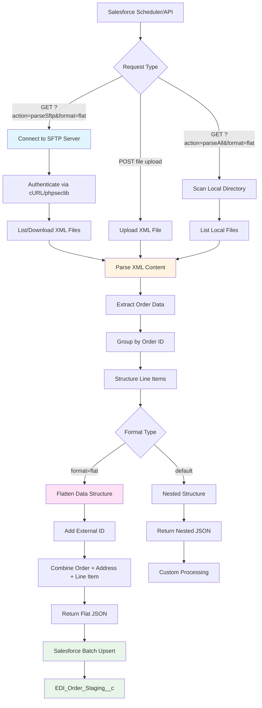

# EDI Orders XML Parser API - Setup Guide

Quick setup instructions for the EDI Parser API.

---

## Deployment Information

- **Heroku App**: `sftpserver-uat-edi`
- **GitHub Repository**: `GoldFinch-Cloud-Solutions/EDI-Parser`
- **Live URL**: `https://sftpserver-uat-edi-6bdcffe140e3.herokuapp.com/index.php`
- **Deployment**: Automatic via GitHub integration

---

## Architecture Flow Diagram



**Flow Description:**

1. **Salesforce Request** → Scheduled job or API calls PHP endpoint
2. **SFTP Connection** → Connect using cURL (libssh2) or phpseclib
3. **XML Parsing** → Parse Microsoft Excel SpreadsheetML format
4. **Data Structuring** → Group orders and line items
5. **Format Selection** → Flat format for Salesforce or nested for custom use
6. **External ID Generation** → Create unique ID (DocumentId-LineNo)
7. **Salesforce Upsert** → Batch upsert to staging table using External ID

---

## Prerequisites

- PHP 7.4+ with SimpleXML and cURL extensions
- cURL with SFTP support (libssh2)

---

## Local Development

1. Copy files to: `C:\xampp\htdocs\edi_files\`
2. Create directory: `C:\xampp\htdocs\edi_files\orders\`
3. Test locally: `http://localhost/edi_files/index.php?action=list`

---

## GitHub Repository Setup

Repository already configured at: `GoldFinch-Cloud-Solutions/EDI-Parser`

To push updates:

```bash
git add .
git commit -m "Your commit message"
git push origin main
```

---

## Heroku Configuration

### Environment Variables (Already Set)

```bash
heroku config:set SFTP_HOST=virginia.sftptogo.com
heroku config:set SFTP_PORT=22
heroku config:set SFTP_USERNAME=your_username
heroku config:set SFTP_PASSWORD=your_password
heroku config:set SFTP_REMOTE_PATH=/EDI_Orders
```

### View Current Config

```bash
heroku config -a sftpserver-uat-edi
```

### View Logs

```bash
heroku logs --tail -a sftpserver-uat-edi
```

---

## Heroku-GitHub Integration

Already connected. Any push to the `main` branch automatically deploys to Heroku.

To manually deploy:

```bash
git push origin main
```

Or via Heroku dashboard:

1. Go to `sftpserver-uat-edi` app
2. Navigate to "Deploy" tab
3. Click "Deploy Branch"

---

## API Endpoints

**Base URL**: `https://sftpserver-uat-edi-6bdcffe140e3.herokuapp.com/index.php`

### Standard Endpoints

| Endpoint               | Description                               |
| ---------------------- | ----------------------------------------- |
| `?action=listSftp`     | List XML files on SFTP server             |
| `?action=parseSftp`    | Parse all files from SFTP (nested format) |
| `?action=downloadSftp` | Download files from SFTP                  |
| `?action=list`         | List local XML files                      |
| `?action=parseAll`     | Parse all local files (nested format)     |
| `?file=filename.xml`   | Parse single file (nested format)         |

### Salesforce Integration Endpoints

| Endpoint                         | Description                                    |
| -------------------------------- | ---------------------------------------------- |
| `?action=parseSftp&format=flat`  | Parse SFTP files - flat format for Salesforce  |
| `?action=parseAll&format=flat`   | Parse local files - flat format for Salesforce |
| `?file=filename.xml&format=flat` | Parse single file - flat format for Salesforce |

**Flat Format Features:**

- One record per line item (no nested structure)
- External ID field: `externalId` (DocumentId-LineNo)
- All order, address, terms, and line item data in single record
- Optimized for Salesforce batch upsert operations

---

## Testing

### Test SFTP Connection

```bash
curl https://sftpserver-uat-edi-6bdcffe140e3.herokuapp.com/index.php?action=listSftp
```

### Test File Parsing (Nested Format)

```bash
curl https://sftpserver-uat-edi-6bdcffe140e3.herokuapp.com/index.php?action=parseSftp
```

### Test File Parsing (Flat Format for Salesforce)

```bash
curl https://sftpserver-uat-edi-6bdcffe140e3.herokuapp.com/index.php?action=parseSftp&format=flat
```

### Test with POST

```bash
curl -X POST -F "file=@orders.xml" https://sftpserver-uat-edi-6bdcffe140e3.herokuapp.com/index.php
```

### Test from Salesforce (Anonymous Apex)

```apex
HttpRequest req = new HttpRequest();
req.setEndpoint('https://sftpserver-uat-edi-6bdcffe140e3.herokuapp.com/index.php?action=parseSftp&format=flat');
req.setMethod('GET');
req.setTimeout(120000);

Http http = new Http();
HttpResponse res = http.send(req);
System.debug('Response: ' + res.getBody());
```

---

## Salesforce Integration

### Setup Requirements

1. **Deploy Salesforce Components** (in `/salesforce` directory):

   - `EDI_Order_Staging__c.object` - Custom object for staging
   - `EDIOrderAPIService.cls` - Main service class
   - `EDIOrderBatchProcessor.cls` - Batch processing for large data
   - `EDIOrderQueueable.cls` - Queueable for async processing
   - `EDIOrderScheduler.cls` - Scheduled automation
   - `EDIOrderAPIServiceTest.cls` - Test coverage

2. **Configure Remote Site Settings**:

   - Navigate to: Setup → Security → Remote Site Settings
   - Add: `https://sftpserver-uat-edi-6bdcffe140e3.herokuapp.com`

3. **Update API Endpoint in Apex**:
   ```apex
   // In EDIOrderAPIService.cls
   private static final String API_ENDPOINT =
       'https://sftpserver-uat-edi-6bdcffe140e3.herokuapp.com/index.php';
   ```

### Usage Examples

#### Manual Import (Small Dataset < 200 records)

```apex
EDIOrderAPIService.EDIOrderResponse response =
    EDIOrderAPIService.fetchAndProcessOrders('parseSftp', true);
System.debug('Imported: ' + response.totalRecords + ' records');
```

#### Async Import (200-2,000 records)

```apex
EDIOrderAPIService.fetchAndProcessOrdersAsync('parseSftp');
```

#### Scheduled Daily Import

```apex
// Schedule to run daily at 2 AM
String jobId = EDIOrderScheduler.scheduleDaily();
System.debug('Scheduled Job ID: ' + jobId);
```

#### Large Dataset (2,000+ records)

```apex
// Automatically routes to Batch Apex
EDIOrderAPIService.fetchAndProcessOrdersQueueable();
```

### Data Flow

1. **API Call** → Salesforce calls PHP API with `format=flat`
2. **Flat Response** → API returns flattened records with `externalId`
3. **Batch Upsert** → Salesforce upserts to `EDI_Order_Staging__c`
4. **External ID Match** → Updates existing records, inserts new ones
5. **Processing** → Custom logic processes staging records

### Response Format

**Nested Format** (default):

```json
{
  "orders": [
    {
      "documentId": "76916821",
      "poNumber": "044846217",
      "billTo": { ... },
      "shipTo": { ... },
      "lineItems": [ ... ]
    }
  ]
}
```

**Flat Format** (`format=flat`):

```json
{
  "records": [
    {
      "externalId": "76916821-0001",
      "documentId": "76916821",
      "poNumber": "044846217",
      "billToCompanyName1": "United Natural Foods",
      "shipToCompanyName1": "UNFI - Moreno Valley",
      "lineNo": "0001",
      "vendorItemNo": "1037",
      "quantityOrdered": 32,
      "unitPrice": 28.8
      // ... all fields in one flat record
    }
  ]
}
```

### Monitoring

#### Check Batch Job Status

```apex
List<AsyncApexJob> jobs = [
    SELECT Status, NumberOfErrors, JobItemsProcessed, TotalJobItems
    FROM AsyncApexJob
    WHERE ApexClass.Name = 'EDIOrderBatchProcessor'
    ORDER BY CreatedDate DESC LIMIT 1
];
```

#### Query Staging Records

```apex
List<EDI_Order_Staging__c> records = [
    SELECT External_ID__c, Processing_Status__c, Error_Message__c
    FROM EDI_Order_Staging__c
    WHERE CreatedDate = TODAY
    ORDER BY CreatedDate DESC
];
```

---

## Common Issues

**Error: "No SFTP library available"**

- Ensure cURL has SFTP support enabled

**Error: "SFTP cURL Error: URL rejected"**

- Already fixed in latest code version

**Error: "Failed to connect to SFTP server"**

- Verify credentials: `heroku config -a sftpserver-uat-edi`
- Check SFTP server status

---

## Updating the Code

1. Make changes locally
2. Test locally
3. Push to GitHub:
   ```bash
   git add .
   git commit -m "Update description"
   git push origin main
   ```
4. Heroku auto-deploys from GitHub

---

## Security Notes

- ✅ Credentials stored in Heroku environment variables
- ✅ Not committed to GitHub repository
- ✅ HTTPS enabled on Heroku

---

## Monitoring

- **Heroku Metrics**: Dashboard → sftpserver-uat-edi → Metrics
- **Logs**: `heroku logs --tail -a sftpserver-uat-edi`
- **Status**: `heroku ps -a sftpserver-uat-edi`

---

**Deployment Complete!** 🚀

Live API: https://sftpserver-uat-edi-6bdcffe140e3.herokuapp.com/index.php
