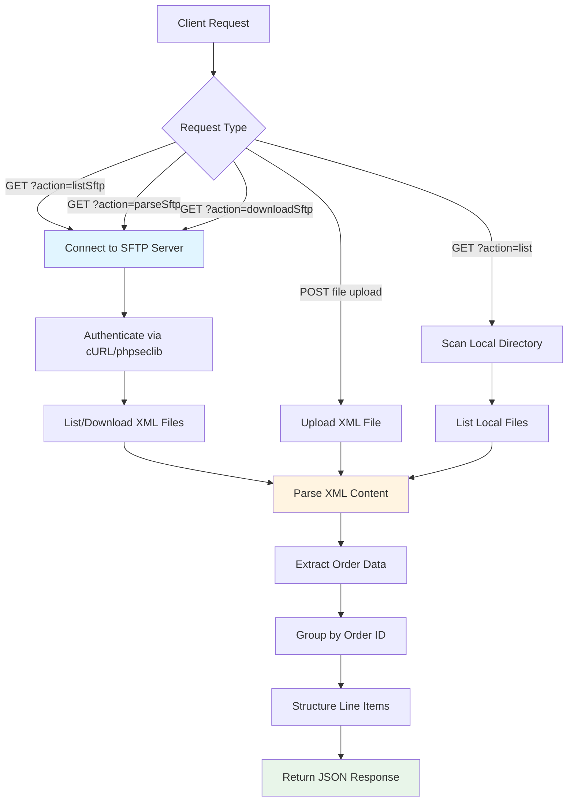

# EDI Orders XML Parser API - Setup Guide

Quick setup instructions for the EDI Parser API.

---

## Deployment Information

- **Heroku App**: `sftpserver-uat-edi`
- **GitHub Repository**: `GoldFinch-Cloud-Solutions/EDI-Parser`
- **Live URL**: `https://sftpserver-uat-edi-6bdcffe140e3.herokuapp.com/index.php`
- **Deployment**: Automatic via GitHub integration

---

## Architecture Flow Diagram



**Flow Description:**

1. **Client Request** → API receives GET/POST request
2. **SFTP Connection** → Connect using cURL (libssh2) or phpseclib
3. **XML Parsing** → Parse Microsoft Excel SpreadsheetML format
4. **Data Structuring** → Group orders and line items
5. **JSON Response** → Return structured data

---

## Prerequisites

- PHP 7.4+ with SimpleXML and cURL extensions
- cURL with SFTP support (libssh2)

---

## Local Development

1. Copy files to: `C:\xampp\htdocs\edi_files\`
2. Create directory: `C:\xampp\htdocs\edi_files\orders\`
3. Test locally: `http://localhost/edi_files/index.php?action=list`

---

## GitHub Repository Setup

Repository already configured at: `GoldFinch-Cloud-Solutions/EDI-Parser`

To push updates:

```bash
git add .
git commit -m "Your commit message"
git push origin main
```

---

## Heroku Configuration

### Environment Variables (Already Set)

```bash
heroku config:set SFTP_HOST=virginia.sftptogo.com
heroku config:set SFTP_PORT=22
heroku config:set SFTP_USERNAME=your_username
heroku config:set SFTP_PASSWORD=your_password
heroku config:set SFTP_REMOTE_PATH=/EDI_Orders
```

### View Current Config

```bash
heroku config -a sftpserver-uat-edi
```

### View Logs

```bash
heroku logs --tail -a sftpserver-uat-edi
```

---

## Heroku-GitHub Integration

Already connected. Any push to the `main` branch automatically deploys to Heroku.

To manually deploy:

```bash
git push origin main
```

Or via Heroku dashboard:

1. Go to `sftpserver-uat-edi` app
2. Navigate to "Deploy" tab
3. Click "Deploy Branch"

---

## API Endpoints

**Base URL**: `https://sftpserver-uat-edi-6bdcffe140e3.herokuapp.com/index.php`

| Endpoint               | Description                   |
| ---------------------- | ----------------------------- |
| `?action=listSftp`     | List XML files on SFTP server |
| `?action=parseSftp`    | Parse all files from SFTP     |
| `?action=downloadSftp` | Download files from SFTP      |
| `?action=list`         | List local XML files          |
| `?action=parseAll`     | Parse all local files         |
| `?file=filename.xml`   | Parse single file             |

---

## Testing

### Test SFTP Connection

```bash
curl https://sftpserver-uat-edi-6bdcffe140e3.herokuapp.com/index.php?action=listSftp
```

### Test File Parsing

```bash
curl https://sftpserver-uat-edi-6bdcffe140e3.herokuapp.com/index.php?action=parseSftp
```

### Test with POST

```bash
curl -X POST -F "file=@orders.xml" https://sftpserver-uat-edi-6bdcffe140e3.herokuapp.com/index.php
```

---

## Common Issues

**Error: "No SFTP library available"**

- Ensure cURL has SFTP support enabled

**Error: "SFTP cURL Error: URL rejected"**

- Already fixed in latest code version

**Error: "Failed to connect to SFTP server"**

- Verify credentials: `heroku config -a sftpserver-uat-edi`
- Check SFTP server status

---

## Updating the Code

1. Make changes locally
2. Test locally
3. Push to GitHub:
   ```bash
   git add .
   git commit -m "Update description"
   git push origin main
   ```
4. Heroku auto-deploys from GitHub

---

## Security Notes

- ✅ Credentials stored in Heroku environment variables
- ✅ Not committed to GitHub repository
- ✅ HTTPS enabled on Heroku

---

## Monitoring

- **Heroku Metrics**: Dashboard → sftpserver-uat-edi → Metrics
- **Logs**: `heroku logs --tail -a sftpserver-uat-edi`
- **Status**: `heroku ps -a sftpserver-uat-edi`

---

**Deployment Complete!** 🚀

Live API: https://sftpserver-uat-edi-6bdcffe140e3.herokuapp.com/index.php
